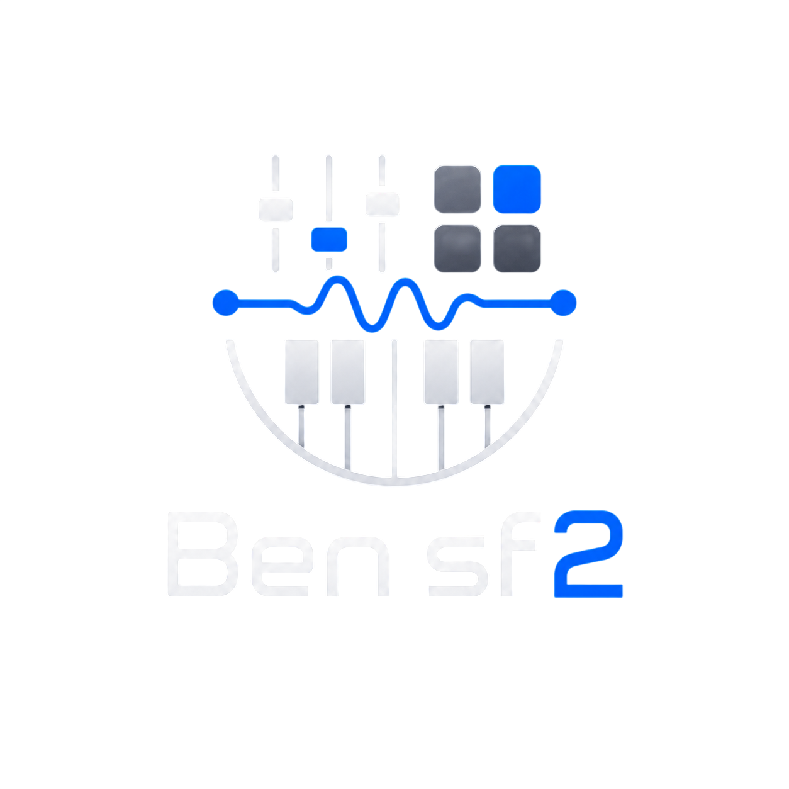

# 🎹 BenSF2 - Live Sampler Workstation & Synthesizer Rig

<p align="center">
  
</p>

<p align="center">
  <b>Uma Workstation Profissional de Síntese Sampler SoundFont (SF2), Split de Teclado & Rack de Efeitos DSP em Tempo Real.</b>
</p>

<p align="center">
  <b>Desenvolvido por <a href="https://github.com/lmiguelviana">Miguel Viana</a></b>
</p>

---

## 🌟 Sobre o Projeto

O **BenSF2** é uma **Workstation Multitímbrica de Áudio (DAW / Live Rig)** de ultra-baixa latência desenvolvida para performances ao vivo e produções musicais. O sistema permite carregar qualquer arquivo `.sf2` (SoundFont 2), empilhar camadas (*Layers*), dividir zonas de notas no teclado (*Split*), aplicar efeitos DSP em cada faixa e automatizar parâmetros via controladores MIDI físicos (USB-OTG e Bluetooth) em ambiente **Desktop (Electron)** ou **Web/Mobile (PWA / TWA)**.

---

## ✨ Destaques & Principais Funcionalidades

### 👨‍💻 Criador & Desenvolvedor Principal
- **Desenvolvido por:** **Miguel Viana** ([@lmiguelviana](https://github.com/lmiguelviana))
- **Foco de Engenharia:** Síntese Web Audio DSP, WebMIDI API, Parsing Binário SF2 e Interface Glassmorphic para Performance ao Vivo.

---

### 🎹 1. Split Interativo de Teclado & Key Zones (`C0..C7`)
- **Divisão Flexível de Zonas**: Cada uma das 16 pistas possui definição independente de faixa de notas (`SPLIT MIN` e `SPLIT MAX`).
- **Gravação Automática no Controlador Físico**: Clique no campo e toque qualquer tecla no seu teclado MIDI (USB/Bluetooth) ou teclado virtual para definir o limite instantaneamente!
- **Digitação Direta**: Suporta notação universal em inglês (`C0`, `C7`, `B3`, `F#4`) e em português (`DO2`, `RE4`, `SOL5`).
- **Layering Global (`TODOS`)**: Por padrão, todas as pistas começam prontas para empilhamento layered no controlador.

### 🔊 2. Motor de Síntese SoundFont 2 (SF2) de Baixa Latência
- **Parser Binário Direto**: Leitura binária nativa de arquivos `.sf2` com alinhamento preciso de blocos de áudio.
- **Sustentação Limpa (Zero Lag)**: Sistema inteligente de cancelamento de vozes anteriores (*Voice Stealing & Fade-ramp*) que elimina engasgos, estalos e lag em instrumentos sustentados (p. ex., Violinos, Strings e Organ).
- **Atribuição Direta e Exclusiva de Timbres**: Clique em um instrumento do banco para atribuí-lo diretamente à pista selecionada.

### 🎛️ 3. Mixer Multitímbrico de 16 Pistas
- **Controles Completos por Canal**: Volume com VU Meter em Canvas a 60 FPS, PAN Estéreo, Transposição por Oitava (-2 a +2) e Semitom (-12 a +12 semitons).
- **Controle de Release & ADSR**: Ajuste dinâmico de ataque, decaimento, sustentação e tempo de liberação do som por faixa.
- **Funções Mute (M), Solo (S) e Edição Inline**: Edite o nome de cada faixa com duplo clique e gerencie pistas com facilidade.

### 🏛️ 4. Efeitos DSP Individuais & Master FX Rack
- **Módulos FX por Pista e Master**: Envelope ADSR, Cutoff Filter, Equalizador 3-Bandas, Chorus Estéreo 3D, Delay/Echo e Reverb Convolutor.
- **Botões de Reset Instantâneo (`↺ Reset`)**: Volte qualquer módulo aos valores padrão com apenas um clique.
- **Master Limiter Incorporado**: Proteção ativa contra *clipping* e distorção em alto-falantes e fones.

### 🔌 5. Automação & MIDI Learn Universal
- **Mapeamento via Botão Direito**: Clique com o botão direito em qualquer knob do sistema para mapear rapidamente a um fader, knob ou slider do seu controlador MIDI físico.
- **Conectividade Total**: Suporte Plug-and-Play para pedais de sustain (CC64), ModWheel (CC1), Pitch Bend e volume de canal.

---

## 📁 Estrutura de Arquivos

```
bensf2/
├── assets/               # Ícones e recursos visuais
├── css/                  # Estilos CSS Vanilla Glassmorphism
│   ├── main.css          # Tema principal e design system dark
│   ├── mixer.css         # Console do mixer de 16 pistas
│   ├── synth-rack.css    # Rack de efeitos FX
│   └── knob.css          # Estilo dos knobs 3D
├── js/                   # Arquivos de Lógica & Engine
│   ├── audio-context.js  # Gerenciador global do Web Audio Context
│   ├── sf2-parser.js     # Parser binário SF2 em JS puro
│   ├── synth-engine.js   # Motor de síntese polifônica e envelopes
│   ├── fx-rack.js        # Módulos de efeitos DSP e Rack
│   ├── mixer.js          # Console do Mixer (16 Canais & Split C0..C7)
│   ├── web-midi.js       # Comunicação WebMIDI e MIDI Learn
│   ├── preset-manager.js # Salvamento e exportação de presets em JSON
│   └── app.js            # Inicialização e controle principal da UI
├── index.html            # Interface de usuário principal
├── main.js               # Processo Electron para Desktop
└── package.json          # Configuração e scripts Node.js
```

---

## 💻 Como Executar

### 1. Clonar o Repositório
```bash
git clone https://github.com/lmiguelviana/bensf2.git
cd bensf2
```

### 2. Instalar Dependências
```bash
npm install
```

### 3. Rodar a Aplicação Desktop (Electron)
```bash
npm start
```

---

## 👤 Autor

**Miguel Viana**
- 🐙 GitHub: [@lmiguelviana](https://github.com/lmiguelviana)
- 🎹 Projeto: **BenSF2 Live Sampler Workstation**

---

## 📜 Licença

Este projeto é distribuído sob a licença **MIT**. Veja o arquivo `LICENSE` para mais detalhes.
